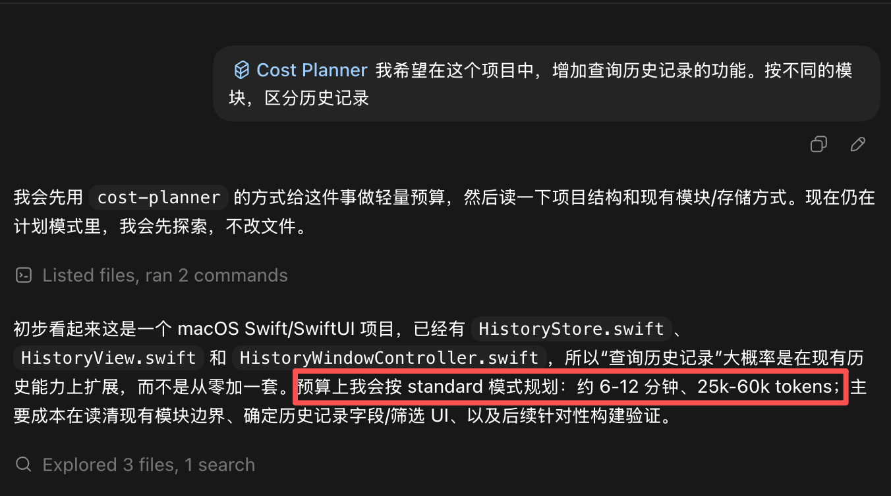

# Cost Planner

在执行 Codex 任务前，提供轻量级的预算评估：时间范围、token 消耗范围、置信度及执行模式选择。

## 触发时机

以下情况会自动或手动触发本技能：

- 用户询问任务成本、token 消耗、执行预算
- 任务范围宽泛、不确定，或预计消耗大量上下文
- 任务涉及高成本操作（全量测试、浏览器 QA、依赖安装、CI/部署等）

对于明显廉价的请求（单行修改、简单命令、窄范围问答），跳过可见的预算输出。

## 执行模式

| 模式 | 时间 | Token | 适用场景 |
|---|---|---|---|
| `quick` | 1–3 min | 5k–15k | 快速分诊、紧急修复，最小化读取和验证 |
| `standard` | 4–8 min | 20k–45k | 常规编码任务，均衡检查与验证（默认） |
| `thorough` | 10–25 min | 60k–120k | 高风险或面向用户的变更，更广泛的搜索和验证 |

## 输出格式

首次响应时输出预算卡片：

```text
I can approach this in standard mode.

Estimated cost:
- Time: 4-8 min
- Tokens: 20k-45k
- Confidence: medium

Main cost drivers:
- Reading related implementation and tests
- Running targeted verification
- Possible second repair loop if tests expose more failures

Modes:
- Quick: 1-3 min, 5k-15k tokens, narrow inspection only
- Standard: 4-8 min, 20k-45k tokens, edit plus targeted verification
- Thorough: 10-25 min, 60k-120k tokens, broader search, tests, and QA
```

执行过程中如发现实际规模与预估差异较大，会修订估算。遭遇高成本操作前会提前告知。

## 文件说明

| 文件 | 说明 |
|---|---|
| `SKILL.md` | 技能元数据与完整行为规范 |
| `agents/openai.yaml` | agent 接口配置（展示名称、默认 prompt、调用策略） |
| `references/budget-schema.md` | 结构化预算字段的 JSON schema 及事件模型，供实现或集成时参考 |
